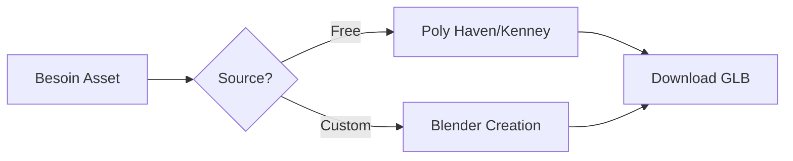

# 📦 OHARA - Asset Pipeline

## Objectif

Pipeline propre, reproductible, optimisé pour :
- Performance web (taille fichiers)
- Qualité visuelle premium
- Workflow collaboratif
- Maintenance long terme

---

## 🎨 Sources Assets (Open-Source Priority)

### Modèles 3D

**Tier 1 : Premium Free** (Utiliser en priorité)

1. **Poly Haven** (https://polyhaven.com/models)
   - Qualité film
   - PBR scanned
   - CC0 (domaine public)
   - Formats : GLB, FBX, Blend
   
2. **Kenney.nl** (https://kenney.nl/assets)
   - 40,000+ assets CC0
   - Style low-poly moderne propre
   - Catégories : Nature, Props, Characters
   - **Recommandé OHARA** : Nature Pack, Village Pack

3. **Quaternius** (https://quaternius.com/packs.html)
   - Stylized low-poly
   - CC0
   - Style cohérent Zelda-like
   - **Recommandé OHARA** : Ultimate Nature, Trees Pack

4. **Sketchfab** (https://sketchfab.com)
   - Filtrer : "Downloadable" + License "CC-BY" ou "CC0"
   - Vérifier topology (pas de n-gons)
   
**Tier 2 : Premium Paid** (Si budget)

5. **Synty Studios** (Unity Asset Store)
   - Low-poly cohérent
   - $20-50 par pack
   
6. **Kay Lousberg** (CGTrader)
   - Nature ultra-optimisée
   - ~$30 par pack

### Textures PBR

**Free**

1. **Poly Haven** (https://polyhaven.com/textures)
   - 8K gratuit
   - PBR complet (Albedo, Normal, Roughness, AO)
   - **Recommandé OHARA** :
     - `rough_bark_01` (arbre écorce)
     - `grassy_ground_01` (pelouse)

2. **AmbientCG** (https://ambientcg.com)
   - CC0
   - Seamless tiles
   - 4K max gratuit

3. **3D Textures** (https://3dtextures.me)
   - Gratuit usage commercial
   - Bonne qualité

**Paid**

4. **Poliigon** ($19/mo)
   - Ultra qualité
   - Si besoin photorealism

### HDRI Environments

**Gratuit** (Suffisant pour OHARA)

1. **Poly Haven** (https://polyhaven.com/hdris)
   - 16K gratuit
   - 360° lighting
   - **Recommandé OHARA** :
     - `forest_slope_2k.hdr` (forêt filtrée)
     - `rural_landscape_2k.hdr` (campagne)
     - `kloppenheim_02_2k.hdr` (soleil doux)

**Paid**

2. **HDRI Haven** (même source que Poly Haven)

---

## 🛠️ Outils de Création

### Modélisation 3D

**Blender** (Gratuit, indispensable)
- Version : 4.0+
- Plugins recommandés :
  - **Geometry Nodes** (procédural trees)
  - **Asset Browser** (organisation)
  - **Poly Haven Addon** (import direct)

**Blockbench** (Gratuit, low-poly)
- Parfait pour props simple
- Export direct GLB
- Web-based

**Spline** (Freemium)
- Prototypage rapide
- Export React Three Fiber
- Bon pour UI 3D

### Optimisation Assets

**gltf-pipeline** (CLI)
```bash
npm install -g gltf-pipeline

# Optimiser GLB
gltf-pipeline -i input.glb -o output.glb -d

# Compression Draco
gltf-pipeline -i input.glb -o output.glb -d --draco.compressionLevel=10
```

**gltfjsx** (R3F)
```bash
npx gltfjsx model.glb --transform

# Génère:
# - model-transformed.glb (optimisé)
# - Model.tsx (composant R3F)
```

**gltf-transform** (CLI moderne)
```bash
npm install -g @gltf-transform/cli

# Optimiser + Draco
gltf-transform optimize input.glb output.glb --texture-compress webp
```

---

## 📏 Standards & Conventions

### Naming Convention

**Format** : `category_name_variant_lod.extension`

**Exemples**
```
tree_oak_01_high.glb
tree_oak_01_medium.glb
tree_oak_01_low.glb

prop_rock_large_01.glb
prop_flower_pink_01.glb

env_ground_grass_01_2k.jpg
env_sky_sunset_01.hdr
```

**Règles**
- Lowercase uniquement
- Underscores (pas de spaces)
- Versioning numérique (`_01`, `_02`)
- LOD explicite (`_high`, `_medium`, `_low`)

### Scale & Units

**Standard** : 1 Blender Unit = 1 Meter

**Références taille OHARA**
- Joueur : `1.8m` (height)
- Arbre du Savoir : `12m` (height)
- Arbres secondaires : `6-8m`
- Fleurs : `0.3-0.4m`
- Ground : `100m` (diameter)

**Export Blender**
```python
# Settings export GLB
- Apply Modifiers: True
- UVs: True
- Normals: True  
- Tangents: True (si normal maps)
- Vertex Colors: False (sauf si utilisé)
- Materials: Export
- Images: Embed (ou separate si >1MB)
- Draco Compression: True
- Compression Level: 6 (balance taille/qualité)
```

### Pivot Points

**Règles strictes**
- Objects au sol : Pivot en bas centre
- Objects suspendus : Pivot au point d'attache
- Symmetric objects : Pivot au centre

**Vérification Blender**
```
Object Mode > Set Origin > Origin to Geometry (Bottom)
```

---

## 🎯 Budgets Assets

### Polygon Count

| Type | High LOD | Medium LOD | Low LOD | Usage |
|------|----------|------------|---------|-------|
| **Hero (Arbre Savoir)** | <5000 | <2000 | <800 | 0-20m / 20-50m / 50m+ |
| **Props (Arbres)** | <600 | <400 | <200 | Instanced |
| **Small Props (Fleurs)** | <20 | <12 | N/A | Instanced |
| **Environment (Sol)** | <1000 | <1000 | <1000 | Static |

### Texture Sizes

| Type | Desktop | Mobile | Format | Compression |
|------|---------|--------|--------|-------------|
| **HDRI** | 2K | 1K | .hdr | N/A |
| **Ground** | 2K | 1K | .webp | 80% quality |
| **Bark** | 1K | 512px | .webp | 80% quality |
| **Props** | 512px | 256px | .webp | 80% quality |

**Mipmaps** : Toujours activés (Three.js par défaut)

---

## 🔄 Workflow Pipeline

### 1. Sourcing



### 2. Import Blender

```
1. Import GLB
2. Vérifier scale (1 unit = 1m)
3. Vérifier pivot point
4. Clean geometry (remove doubles, fix normals)
5. UV unwrap si nécessaire
6. Apply modifiers
```

### 3. Optimisation

```
1. Decimate si >polygon budget
2. Merge by distance (threshold 0.01)
3. Delete loose geometry
4. Recalculate normals
5. Triangulate (pour export)
```

### 4. Materials

**PBR Setup (Standard)**
```
Base Color (sRGB)
Metallic (Linear)
Roughness (Linear)
Normal Map (Linear, Non-Color)
```

**Low-Poly Setup (OHARA)**
```
Base Color only (vertex colors ou texture 512px)
Flat Shading: True
Roughness: 0.8-0.9 (constant)
Metallic: 0 (sauf metal props)
```

### 5. Export GLB

```
File > Export > glTF 2.0 (.glb)

Settings:
- Format: Binary (.glb)
- Include: Selected Objects
- Transform: +Y Up
- Geometry: Apply Modifiers, UVs, Normals
- Compression: Draco (Level 6)
- Animation: None (si static)
```

### 6. Post-Processing CLI

```bash
# Optimisation finale
gltf-transform optimize model.glb model_opt.glb \
  --texture-compress webp \
  --simplify 0.8

# Vérification
gltf-transform inspect model_opt.glb
```

### 7. Integration R3F

```bash
# Générer composant React
npx gltfjsx model_opt.glb --transform

# Résultat:
# - model_opt-transformed.glb (optimisé)
# - Model.tsx (composant)
```

### 8. Preloading

```typescript
// Preload au chargement app
import { useGLTF } from '@react-three/drei'

useGLTF.preload('/models/tree_oak_01_high-transformed.glb')
```

---

## 📂 Structure Dossiers

```
OHARA/
├── public/
│   ├── models/
│   │   ├── trees/
│   │   │   ├── oak_01_high.glb
│   │   │   ├── oak_01_medium.glb
│   │   │   └── oak_01_low.glb
│   │   ├── props/
│   │   │   ├── flower_pink_01.glb
│   │   │   └── rock_large_01.glb
│   │   └── environment/
│   │       └── ground_grass_01.glb
│   ├── textures/
│   │   ├── ground/
│   │   │   ├── grass_01_2k_albedo.webp
│   │   │   ├── grass_01_2k_normal.webp
│   │   │   └── grass_01_2k_roughness.webp
│   │   └── bark/
│   │       └── oak_bark_1k_albedo.webp
│   └── hdri/
│       ├── forest_slope_2k.hdr
│       └── rural_landscape_2k.hdr
└── src/
    └── 3d/
        └── models/
            ├── Tree.tsx (composant généré)
            └── Flower.tsx
```

---

## ✅ Checklist Quality Control

Avant d'intégrer un asset :

### Modèle 3D
- [ ] Scale correct (1 unit = 1m)
- [ ] Pivot point positionné correctement
- [ ] Poly count dans budget
- [ ] Pas de n-gons (tout triangulé)
- [ ] Normals corrects (faces out)
- [ ] UV unwrap propre (si textures)
- [ ] Materials PBR standard
- [ ] Export GLB optimisé

### Textures
- [ ] Taille power-of-2 (256, 512, 1024, 2048)
- [ ] Format WebP (ou JPG si large support)
- [ ] Compression 80% quality
- [ ] sRGB vs Linear correct
- [ ] Mipmaps enabled

### Integration
- [ ] Preload configuré
- [ ] Composant R3F généré (si GLB)
- [ ] LOD setup (si applicable)
- [ ] Dispose() implementé
- [ ] Performance testée (FPS impact)

---

## 🚨 Common Pitfalls

### ❌ Erreurs Fréquentes

1. **Forgot Draco Compression**
   - GLB 5MB → 500KB avec Draco
   
2. **Wrong Scale**
   - Arbre 0.1m au lieu de 10m
   - Toujours vérifier dans Blender
   
3. **N-gons in Mesh**
   - Cause rendering artifacts
   - Toujours triangulate avant export
   
4. **Non-Power-of-2 Textures**
   - 1000x1000 → doit être 1024x1024
   - WebGL performance impact
   
5. **sRGB vs Linear Confusion**
   - Base Color = sRGB
   - Normal/Roughness/Metallic = Linear

---

## 📊 Performance Metrics

### Targets

| Metric | Target | Max |
|--------|--------|-----|
| **Total GLB Size** | <5MB | <10MB |
| **Single Model Size** | <500KB | <1MB |
| **Texture Total Size** | <10MB | <20MB |
| **HDRI Size** | <2MB | <5MB |
| **Load Time (3G)** | <3s | <5s |

### Monitoring

```typescript
// Track assets loaded
console.log(renderer.info.memory.geometries)
console.log(renderer.info.memory.textures)

// Bundle analyzer
npm run build --analyze
```

---

## 🔮 Évolutions Futures

### Phase 2 : Advanced Assets

- Animated characters (mixamo)
- Particle systems (VFX)
- Custom shaders (TSL)

### Phase 3 : Procedural

- Blender Geometry Nodes export
- Runtime procedural generation
- Infinite terrain LOD

---

**Version** : 1.0  
**Dernière mise à jour** : 2026-01-15  
**Status** : ✅ Production Ready
